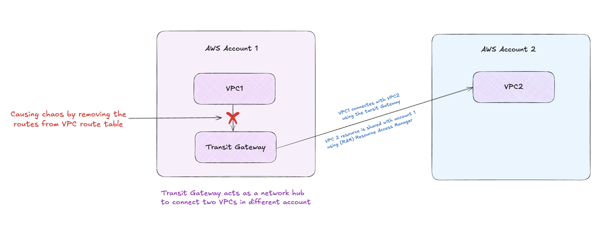
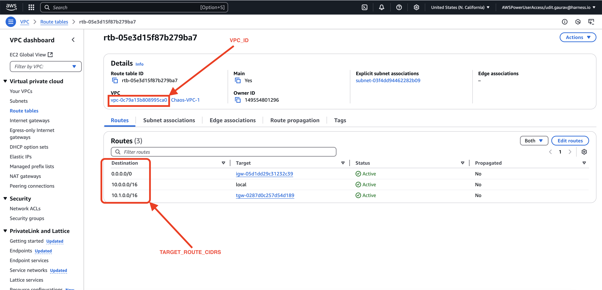

# VPC Route Chaos Experiment

## Overview




This experiment simulates a **misconfiguration** fault by temporarily removing one or more target CIDR routes from the VPC route table. So the working is:

- Temporarily removing specific CIDR routes from VPC route tables
- Waiting for a chaos duration to observe impact
- Automatically recovering the exact route configuration


_Note:  It safely ignores local routes and supports multiple CIDRs via a single run._

It mimics scenarios such as:

- Misconfigured VPC route changes
- Accidental deletion of external or internal routes
- Loss of routing to TGW, NATGW, or Peering connections


## AWS IAM Policy – Minimum Permissions

The fault requires the following **EC2 route table permissions**

```json
{
  "Version": "2012-10-17",
  "Statement": [
    {
      "Effect": "Allow",
      "Action": [
        "ec2:DescribeRouteTables",
        "ec2:DescribeVpcs",
        "ec2:DeleteRoute",
        "ec2:CreateRoute"
      ],
      "Resource": "*"
    }
  ]
}
```

## Input Table

| Variable                   | Description                                                                 | Required | Behavior                                                                 |
|----------------------------|-----------------------------------------------------------------------------|----------|--------------------------------------------------------------------------|
| VPC_ID                     | The ID of the VPC where route chaos will be performed                      | Yes      | Route tables in this VPC will be considered based on selection criteria |
| TARGET_ROUTES_CIDR         | Comma-separated CIDR blocks to target (e.g., 10.0.0.0/16,0.0.0.0/0)         | Yes      | Only routes with these CIDRs will be targeted                            |
| REGION                     | AWS region where the VPC resides (e.g., us-west-2)                          | Yes      | Specifies AWS region for resource operations                             |
| CHAOS_DURATION             | Provide the chaos duration in seconds                               | No       | Duration of the chaos experiment (default: 60 seconds)                   |
| TARGET_ROUTE_TABLE_IDS     | Comma-separated route table IDs (e.g., rtb-123,rtb-456)                     | No       | Only the specified route tables will be targeted under the given VPC                         |
| TARGET_ROUTE_TABLE_TAG     | Key-value pair (e.g., type=chaos)                                           | No       | Only route tables matching the given tag will be targeted under the specified VPC                |
| Both TARGET_ROUTE_TABLE_IDS and TARGET_ROUTE_TABLE_TAG variables are provided   | ❌ Invalid usage                                                            | No       | The fault will exit with an error; only one of the two should be used    |
| Both TARGET_ROUTE_TABLE_IDS and TARGET_ROUTE_TABLE_TAG variables are empty       | (default behavior)                                                         | No       | All route tables in the specified VPC will be targeted                   |


## How to select the target routes


